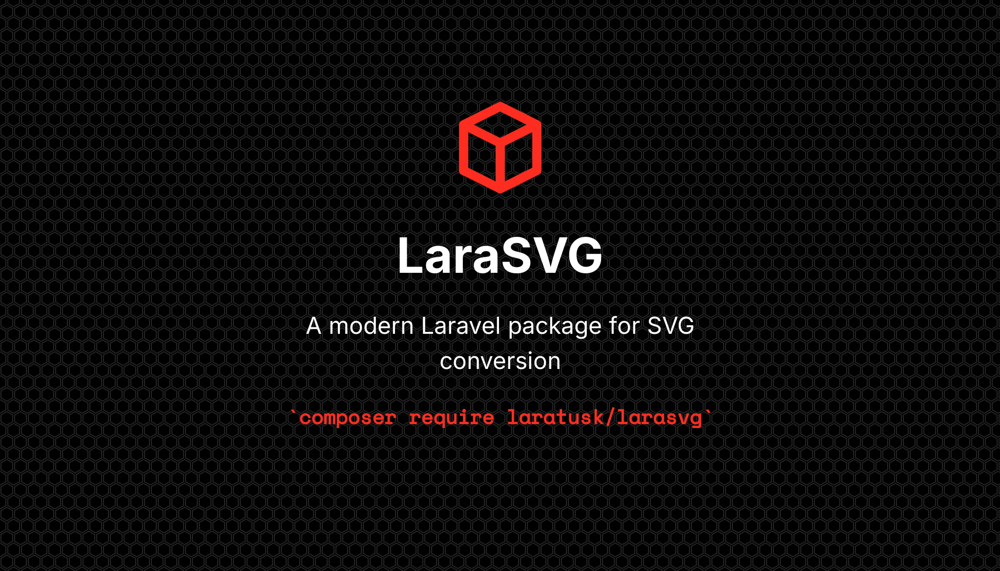

<p align="center">
    
</p>

<p align="center">
    <a href="https://packagist.org/packages/laratusk/larasvg"></a>
    <a href="https://packagist.org/packages/laratusk/larasvg"></a>
    <a href="https://packagist.org/packages/laratusk/larasvg"></a>
    <a href="https://github.com/laratusk/larasvg/actions"></a>
    <a href="https://packagist.org/packages/laratusk/larasvg"></a>
</p>

A modern Laravel package for SVG conversion with multiple provider support. Convert SVG files to PNG, PDF, EPS, and more using a fluent API and Laravel's Process facade.

## Requirements

- PHP 8.2+
- Laravel 10.x, 11.x, or 12.x
- At least one converter: [Resvg](https://github.com/linebender/resvg) or [Inkscape](https://inkscape.org/) 1.0+

## Quick Install

```bash
composer require laratusk/larasvg
```

## Documentation

Visit the **[full documentation](https://laratusk.github.io/larasvg/)** for detailed guides, usage examples, API reference, and more.

## Features

- **Multi-provider architecture** — Switch between Resvg and Inkscape with a single method call
- **Resvg (default)** — Lightning-fast SVG to PNG conversion
- **Inkscape** — Full-featured SVG conversion to PNG, PDF, PS, EPS, EMF, WMF
- **Fluent API** — Chainable methods for dimensions, background, format, and provider-specific options
- **Laravel Filesystem** — Read from and write to any Laravel disk (S3, local, etc.)
- **Testable** — Built on Laravel's Process facade with full `Process::fake()` support

## Quick Start

```php
use Laratusk\Larasvg\Facades\SvgConverter;

SvgConverter::open(resource_path('svg/file.svg'))
    ->setFormat('png')
    ->setDimensions(1024, 1024)
    ->toFile(storage_path('app/output.png'));
```

## Contributing

Please see [CONTRIBUTING.md](CONTRIBUTING.md) for details.

## License

MIT License. See [LICENSE](LICENSE) for details.
